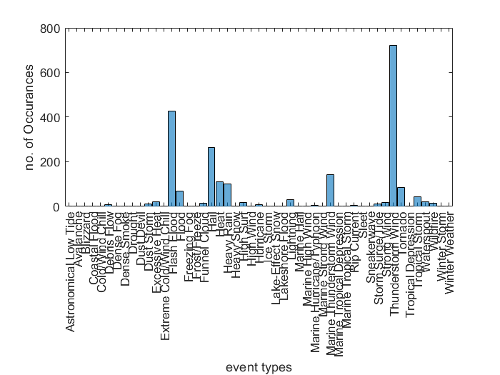
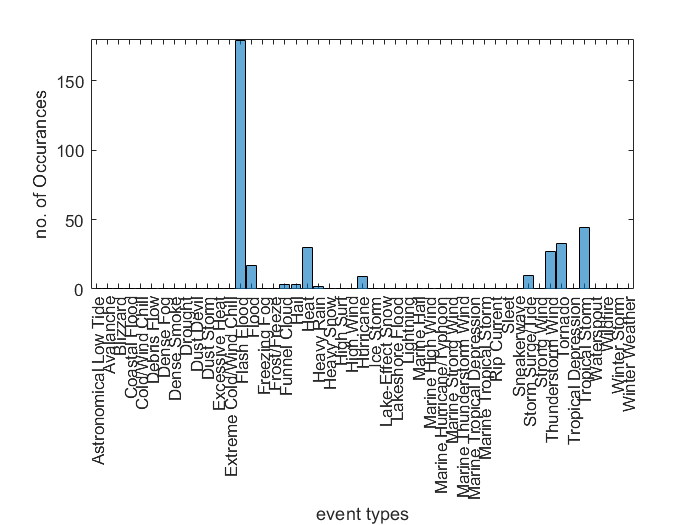
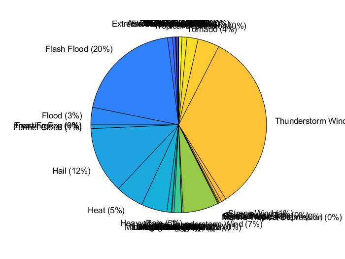
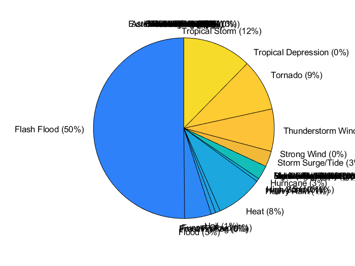
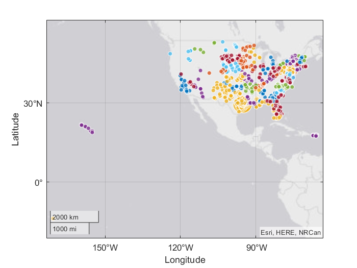
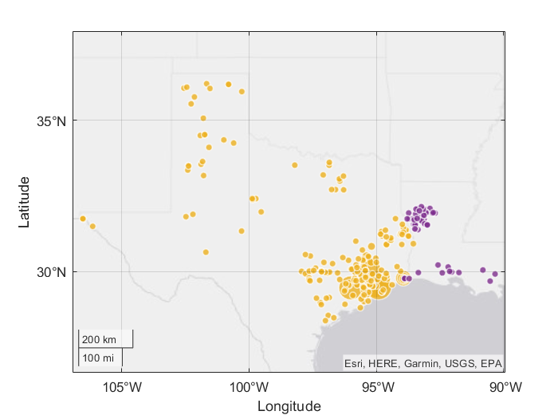

# Hurricane Harvey Report
# Importing and data processing

```matlab:Code
events = importfile("StormEvents_2017_finalProject.csv");

% Put months in correct order
monthOrder = ["January", "February", "March", "April", "May", "June", "July",...
    "August", "September", "October", "November", "December"];
events.Month = reordercats(events.Month, monthOrder);

% Set missing Property and Crop Cost to $0
events.Property_Cost(ismissing(events.Property_Cost)) = 0;
events.Crop_Cost(ismissing(events.Crop_Cost)) = 0;
% Add total damage to the table
events.Total_Damage = events.Property_Cost + events.Crop_Cost;
harveyEvents = events(events.Begin_Date_Time >= "2017-08-17 00:00:00" & events.End_Date_Time < "2017-09-04 00:00:00", :);
head(harveyEvents)
```

| |EpisodeID|Event_ID|State|Year|Month|Event_Type|CZ_Name|Begin_Date_Time|Timezone|End_Date_Time|Injuries_Direct|Injuries_Indirect|Deaths_Direct|Deaths_Indirect|Damage_Property|Property_Cost|Damage_Crops|Crop_Cost|Begin_Lat|Begin_Lon|End_Lat|End_Lon|Episode_Narrative|Event_Narrative|Total_Damage|
|:--:|:--:|:--:|:--:|:--:|:--:|:--:|:--:|:--:|:--:|:--:|:--:|:--:|:--:|:--:|:--:|:--:|:--:|:--:|:--:|:--:|:--:|:--:|:--:|:--:|:--:|
|1|119542|726661|IOWA|2017|August|Tornado|STORY|2017-08-21 16:58:00|-6|2017-08-21 16:59:00|0|0|0|0|0|0|3|3000|41.9496|-93.5614|41.9378|-93.5475|With the help of a c...|"Tornado captured by...|3000|
|2|119542|726659|IOWA|2017|August|Tornado|BOONE|2017-08-21 16:52:00|-6|2017-08-21 16:54:00|0|0|0|0|5|5000|5|5000|41.9490|-93.7256|41.9304|-93.6981|With the help of a c...|"This tornado was fo...|10000|
|3|119542|726660|IOWA|2017|August|Tornado|STORY|2017-08-21 16:54:00|-6|2017-08-21 16:55:00|0|0|0|0|0|0|4|4000|41.9304|-93.6981|41.9223|-93.6739|With the help of a c...|"Tornado found in hi...|4000|
|4|119542|717362|IOWA|2017|August|Heavy Rain|AUDUBON|2017-08-20 22:30:00|-6|2017-08-21 08:13:00|0|0|0|0|0|0|0|0|41.7200|-94.9200|41.7200|-94.9200|With the help of a c...|"Local fire departme...|0|
|5|119542|717363|IOWA|2017|August|Heavy Rain|POLK|2017-08-20 23:00:00|-6|2017-08-21 15:00:00|0|0|0|0|0|0|0|0|41.7200|-93.7900|41.7200|-93.7900|With the help of a c...|"KCCI relayed a view...|0|
|6|119542|717364|IOWA|2017|August|Thunderstorm Wind|POWESHIEK|2017-08-21 18:05:00|-6|2017-08-21 18:05:00|0|0|0|0|0|0|0|0|41.6959|-92.4452|41.6959|-92.4452|With the help of a c...|"Emergency manager r...|0|
|7|120232|720731|VIRGINIA|2017|August|Heavy Rain|NORFOLK (C)|2017-08-29 08:30:00|-5|2017-08-29 08:30:00|0|0|0|0|0|0|0|0|36.8700|-76.2700|36.8700|-76.2700|Low pressure moving ...|"Rainfall total of 3...|0|
|8|120232|720732|VIRGINIA|2017|August|Heavy Rain|NORTHAMPTON|2017-08-29 17:21:00|-5|2017-08-29 17:21:00|0|0|0|0|0|0|0|0|37.2800|-75.9982|37.2800|-75.9982|Low pressure moving ...|"Rainfall total of 6...|0|

## Two States Most Impacted by Harvey

```matlab:Code
groupsummary(harveyEvents,"State","sum","Total_Damage");
ans = sortrows(ans,'sum_Total_Damage','descend');
head(ans)
```

| |State|GroupCount|sum_Total_Damage|
|:--:|:--:|:--:|:--:|
|1|TEXAS|272|7.7493e+10|
|2|LOUISIANA|85|75277000|
|3|NEBRASKA|62|16154000|
|4|NORTH CAROLINA|59|12338500|
|5|WASHINGTON|2|4000000|
|6|FLORIDA|68|2237000|
|7|MINNESOTA|24|1625000|
|8|MISSISSIPPI|39|915000|

*So the most impacted states are Texas and Louisiana.*

## Table of Events for Two Most Impacted States

```matlab:Code
texasLouisianaevents = harveyEvents(ismember(harveyEvents.State,{'LOUISIANA','TEXAS'}),:);
head(texasLouisianaevents)
```

| |EpisodeID|Event_ID|State|Year|Month|Event_Type|CZ_Name|Begin_Date_Time|Timezone|End_Date_Time|Injuries_Direct|Injuries_Indirect|Deaths_Direct|Deaths_Indirect|Damage_Property|Property_Cost|Damage_Crops|Crop_Cost|Begin_Lat|Begin_Lon|End_Lat|End_Lon|Episode_Narrative|Event_Narrative|Total_Damage|
|:--:|:--:|:--:|:--:|:--:|:--:|:--:|:--:|:--:|:--:|:--:|:--:|:--:|:--:|:--:|:--:|:--:|:--:|:--:|:--:|:--:|:--:|:--:|:--:|:--:|:--:|
|1|119753|723472|TEXAS|2017|August|Tropical Storm|MONTGOMERY|2017-08-25 12:00:00|-6|2017-08-30 00:00:00|0|0|3|1|7|7.0000e+09|NaN|0|NaN|NaN|NaN|NaN|Harvey made landfall...|"Tropical Storm Harv...|7.0000e+09|
|2|119753|723473|TEXAS|2017|August|Tropical Storm|FORT BEND|2017-08-26 00:00:00|-6|2017-08-30 00:00:00|0|0|3|0|8|8.0000e+09|NaN|0|NaN|NaN|NaN|NaN|Harvey made landfall...|"Harvey made landfal...|8.0000e+09|
|3|119753|723449|TEXAS|2017|August|Tropical Storm|GALVESTON|2017-08-25 12:00:00|-6|2017-08-30 00:00:00|0|0|3|3|10|1.0000e+10|NaN|0|NaN|NaN|NaN|NaN|Harvey made landfall...|"Galveston County ex...|1.0000e+10|
|4|119753|723474|TEXAS|2017|August|Tropical Storm|SAN JACINTO|2017-08-25 12:00:00|-6|2017-08-30 00:00:00|0|0|3|0|350|350000000|NaN|0|NaN|NaN|NaN|NaN|Harvey made landfall...|"Slow moving Tropica...|350000000|
|5|119753|723475|TEXAS|2017|August|Tropical Storm|WALKER|2017-08-25 12:00:00|-6|2017-08-30 00:00:00|0|0|1|0|600|600000000|NaN|0|NaN|NaN|NaN|NaN|Harvey made landfall...|"Slow moving Tropica...|600000000|
|6|119753|723648|TEXAS|2017|August|Tropical Storm|POLK|2017-08-25 12:00:00|-6|2017-08-30 00:00:00|0|0|0|0|300|300000000|NaN|0|NaN|NaN|NaN|NaN|Harvey made landfall...|"Slow moving Tropica...|300000000|
|7|120011|719146|TEXAS|2017|August|Flash Flood|EL PASO|2017-08-23 16:15:00|-7|2017-08-23 17:15:00|0|0|0|0|0|0|0|0|31.5285|-106.1346|31.5183|-106.1176|A surface low was lo...|"Water was about 6 i...|0|
|8|120012|719147|TEXAS|2017|August|Thunderstorm Wind|EL PASO|2017-08-25 18:10:00|-7|2017-08-25 18:10:00|0|0|0|0|0|0|0|0|31.7715|-106.5028|31.7715|-106.5028|An upper high was lo...|""|0|

# Visualizations

We will use Histograms, Pie Charts and Geographic plots.

  
## Figures of Event Types

```matlab:Code
% Histogram of Event Types distribution due to the Hurricane - Harvey, 
% in all of USA
histogram(harveyEvents.Event_Type)
xlabel('event types')
ylabel('no. of Occurances')
```



```matlab:Code
% Histogram of Event Types distribution due to the Hurricane - Harvey, 
% in the states of Texas and Louisiana
histogram(texasLouisianaevents.Event_Type)
xlabel('event types')
ylabel('no. of Occurances')
```



```matlab:Code
% Pie Chart on the distribution of event types due to Hurricane - Harvey,
% in all of USA
pie(harveyEvents.Event_Type)
```



The overall effect of the hurricane must have been thunderstorms and winds.

  

```matlab:Code
% Pie Chart on the distribution of event types due to Hurricane - Harvey,
% in the states of Texas and Louisiana
pie(texasLouisianaevents.Event_Type)
```



So most of the damage in Texas and Louisiana must have been due to floods.

## Figures of Event Locations

```matlab:Code
% Geographic plot of the event START locations 
% due to the Hurricane - Harvey,
% in all of USA
geobubble(harveyEvents.Begin_Lat,harveyEvents.Begin_Lon,harveyEvents.Total_Damage,harveyEvents.State);
```



The eastern coastal states have had more effect than the rest of USA.

  

```matlab:Code
% Geographic plot of the event START locations 
% due to the Hurricane - Harvey,
% in the states of Texas and Louisiana
geobubble(texasLouisianaevents.Begin_Lat,texasLouisianaevents.Begin_Lon,texasLouisianaevents.Total_Damage,texasLouisianaevents.State);
```



And inside the most affected states, their eastern coast have had the most casualities.

# Analysis

We will use tables to analyse the follwing.

## Three Counties with Most Events in Texas

```matlab:Code
texasEvents = texasLouisianaevents(texasLouisianaevents.State ~= 'LOUISIANA',:);
groupsummary(texasEvents,"CZ_Name");
ans = sortrows(ans,'GroupCount','descend');
head(ans)
```

| |CZ_Name|GroupCount|
|:--:|:--:|:--:|
|1|HARRIS|21|
|2|GALVESTON|17|
|3|FORT BEND|13|
|4|ANGELINA|12|
|5|BRAZORIA|12|
|6|SABINE|12|
|7|BASTROP|9|
|8|CHAMBERS|8|

Harris, Galveston, Fort Bend have had the most events in Texas due to the Hurricane - Harvey.

## Three Counties with Most Events in Louisiana

```matlab:Code
louisianaEvents = texasLouisianaevents(texasLouisianaevents.State ~= 'TEXAS',:);
groupsummary(louisianaEvents,"CZ_Name");
ans = sortrows(ans,'GroupCount','descend');
head(ans)
```

| |CZ_Name|GroupCount|
|:--:|:--:|:--:|
|1|NATCHITOCHES|21|
|2|SABINE|15|
|3|RED RIVER|9|
|4|WINN|6|
|5|VERMILION|4|
|6|CAMERON|3|
|7|DE SOTO|3|
|8|UNION|2|

Natchitoches, Sabine and Red River have had the most events in Louisiana due to the Hurricane - Harvey.

## Three Counties with Highest Property Cost in Texas

```matlab:Code
groupsummary(texasEvents,"CZ_Name","sum","Property_Cost");
ans = sortrows(ans,'sum_Property_Cost','descend');
head(ans)
```

| |CZ_Name|GroupCount|sum_Property_Cost|
|:--:|:--:|:--:|:--:|
|1|GALVESTON|17|2.0000e+10|
|2|FORT BEND|13|1.6004e+10|
|3|MONTGOMERY|6|1.4000e+10|
|4|HARRIS|21|1.0001e+10|
|5|JEFFERSON|4|3.0000e+09|
|6|BRAZORIA|12|2.0008e+09|
|7|ARANSAS|2|1.9500e+09|
|8|ORANGE|2|1.5000e+09|

Galveston, Fort Bend and Montgomery have had the highest reported property costs in the state of Texas due to the Hurricane - Harvey. The costs being 16004M and $14B respectively. 

## Three Counties with Highest Property Cost in Louisiana

```matlab:Code
groupsummary(louisianaEvents,"CZ_Name","sum","Property_Cost");
ans = sortrows(ans,'sum_Property_Cost','descend');
head(ans)
```

| |CZ_Name|GroupCount|sum_Property_Cost|
|:--:|:--:|:--:|:--:|
|1|CALCASIEU|1|60000000|
|2|BEAUREGARD|1|15000000|
|3|ACADIA|1|200000|
|4|CAMERON|3|72000|
|5|VERMILION|4|5000|
|6|BIENVILLE|1|0|
|7|BOSSIER|1|0|
|8|CADDO|1|0|

Calcasieu, Beauregard and Acadia have had the highest reported property costs in the state of Louisiana due to the Hurricane - Harvey. The costs being 15M and $200K respectively. 

# Conclusions and Recommendations

Hence from the above analysis we can say that the south eastern coast has had the maximum casualities due to the Hurricane - Harvey. The resources can be allocated to the countries of Galveston, Fort Bend and Montgomery in Texas, and to the countries of Calcasieu, Beauregard and Acadia in  Louisiana in top priority. And then to Harris in Texas and Natchitoches, Sabine and Red River in Louisiana next. There after to other parts of these two states and other states.

***
*Generated from finalProject.mlx with [Live Script to Markdown Converter](https://github.com/roslovets/Live-Script-to-Markdown-Converter)*
